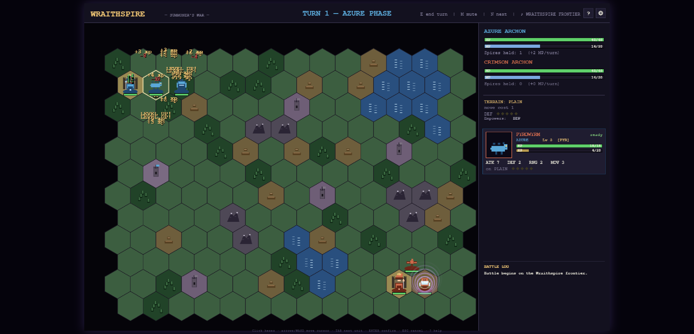

# Wraithspire — Summoner's War

A 16-bit-styled, turn-based hex strategy game with cinematic battle cutaways and a procedural 80s synth-fantasy score. Two summoning archons fight over a frontier of spires and citadels. Original work inspired by Genesis-era summoner strategy.



## Play

Open `index.html` in any modern browser. No build step, no dependencies, no server.

```
start index.html      # Windows
open  index.html      # macOS
xdg-open index.html   # Linux
```

The canvas scales to fit your viewport at a fixed 16:10 ratio, crisp from laptop screens to 4K.

**Goal:** reduce the enemy Archon to 0 HP. The match ends the moment a master falls.

## What's in the box

- **12 summonable monsters** across 5 elements, each with **8 evolved terminal forms** — units earn XP in combat, level 1–5 with stat growth, and a level-4+ unit that starts its turn on one of your spires **evolves**.
- **Cinematic battle cutaways** — side-view arenas themed by the defender's terrain, per-unit attack animations, screen shake, counterattacks. Can be toggled off in settings for fast play.
- **4 skirmish maps** (size, terrain mix, and spire count all differ) plus a **4-mission campaign** with escalating difficulty and narrative interstitials.
- **3 AI difficulties** — Hard plays a threat-map: it focus-fires wounded units, retreats to heal, holds high ground, captures with everything, and counter-picks summons against your army's elements.
- **Autosave every turn** — CONTINUE on the title screen resumes mid-match; campaign progress persists.
- **Undo move** — until you attack, capture, or summon, a move can be taken back from the action menu.
- **Fully keyboard-playable**, procedural synth score (5 tracks), settings menu, in-game help with an element wheel.

## Controls

| Input | Action |
|---|---|
| Mouse hover / click | Inspect hex · select unit · move · attack |
| Arrows / WASD | Move the hex cursor (camera follows) |
| Enter | Select / act at cursor |
| Tab | Jump to your next ready unit |
| E | End turn |
| Esc | Cancel menu / deselect / close overlays |
| ? or H | Help overlay (controls + element wheel) |
| ⚙ (top-right) | Settings: volumes, music track, battle scenes on/off |
| Space | Center camera on selected unit |
| Mouse wheel over log | Scroll battle log history |
| M / N | Toggle music / next track |

The sidebar shows a full info card for the hovered unit. Hover an enemy while one of your units is selected to see a **damage forecast** for the exchange (damage range, element multiplier, counter risk, guaranteed-KO flag).

## How a turn works

1. Your Archon regenerates MP each turn; every captured spire adds +2.
2. Move any unit onto a neutral or enemy spire and **Capture** it — every unit can capture, not just the Archon.
3. **Summon** (Archon only) spends MP to place a monster on an adjacent hex; it can't act the turn it appears.
4. Units standing on your spire heal +2/turn; on your citadel +4/turn.
5. Element wheel: **Pyro ▶ Zephyr ▶ Terra ▶ Hydro ▶ Pyro** (130% / 70%); **Arcane** chips 110% against everything. Attacking *from* terrain your element resonates with (e.g. Pyro on hills, Arcane on spires) adds **+20%** — resonant tiles glint gold when you select a unit.
6. Terrain also sets move cost and defense; mountains are flyer-only, water blocks ground units outright.

## Audio

The score is generated live with Web Audio — drums, filter-swept bass, pads, and lead over a minor progression, five selectable tracks. Auto-starts on the first click/keypress (browser autoplay policy). M toggles it any time.

## Development

```
node --check game.js   # syntax gate
bash smoke-test.sh     # headless boot + one full turn (needs Chrome)
```

Everything lives in two files: `index.html` + `game.js` (banner-numbered sections; see `CLAUDE.md` for the architecture map and content-addition recipes). All art and audio are procedural — there are no asset files.

URL hash hooks for verification: `#autostart` (skip title), `#demo` (AI plays), `#battle` (instant cutaway), `#gameover` (victory screen), `#smoke` (headless smoke test marker).
